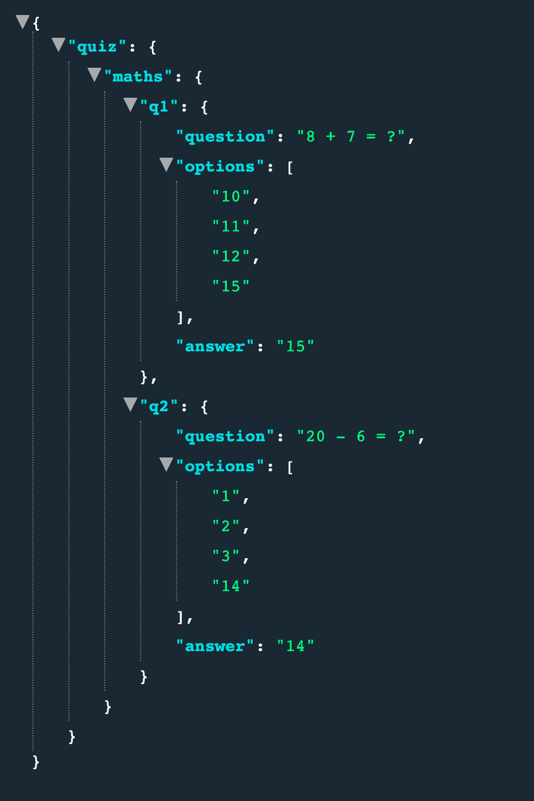
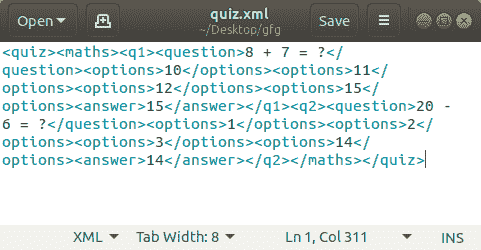

# Python–JSON 转 XML

> 原文:[https://www.geeksforgeeks.org/python-json-to-xml/](https://www.geeksforgeeks.org/python-json-to-xml/)

一个 **JSON** 文件是以 JavaScript Object notification(JSON)格式存储简单数据结构和对象的文件，这是一种标准的数据交换格式。它主要用于在 web 应用程序和服务器之间传输数据。一个 **JSON** 对象包含键/值对形式的数据。键是字符串，值是 JSON 类型。键和值用冒号分隔。每个条目(键/值对)由逗号分隔。JSON 文件是轻量级的、基于文本的、人类可读的，并且可以使用文本编辑器进行编辑。

**注:**更多信息请参考[使用 Python 中的 JSON 数据](http://geeksforgeeks.org/working-with-json-data-in-python/)

**XML** 是一种设计用于存储数据的标记语言。它区分大小写。XML 提供了定义标记元素和生成定制标记语言的功能。XML 中的基本单元被称为元素。XML 语言没有预定义的标记。它简化了数据共享、数据传输、平台变更、数据可用性。可扩展标记语言

**注:**更多信息请参考 [XML |基础知识](http://geeksforgeeks.org/xml-basics/)

JSON 和 XML 文件格式都用于在客户机和服务器之间传输数据。
然而，它们都服务于相同的目的，尽管在途中有所不同。

## JSON 与 XML 的比较

| JSON | 可扩展标记语言 |
| --- | --- |
| JSON 对象有一个类型 | XML 数据是无类型的 |
| JSON 类型:字符串、数字、数组、布尔值 | 所有的 XML 数据都应该是字符串 |
| 数据很容易作为 JSON 对象访问 | 需要解析 XML 数据 |
| 大多数浏览器都支持 JSON | 跨浏览器的 XML 解析可能很棘手 |
| JSON 没有显示功能 | XML 提供了显示数据的能力，因为它是一种标记语言 |
| JSON 只支持文本和数字数据类型。 | XML 支持各种数据类型，如数字、文本、图像、图表、图形等。它还提供了用实际数据传输数据结构或格式的选项。 |
| 检索值很容易 | 检索值很困难 |
| 受到许多 Ajax 工具包支持 | Ajax 工具包不完全支持 |
| 反序列化/序列化 JavaScript 的全自动方式 | 开发人员必须编写 JavaScript 代码来序列化/反序列化 XML |
| 对象的本机支持 | 对象必须用约定来表达——大多数情况下，属性和元素的使用被遗漏了。 |
| 它只支持 UTF-8 编码。 | 它支持各种编码 |
| 不支持评论。 | 它支持评论。 |
| 与 XML 相比，JSON 文件易于阅读。 | XML 文档相对更难阅读和解释。 |
| 它不提供任何名称空间支持 | 它支持名称空间。 |
| 它不太安全。 | 它比 JSON 更安全。 |

## 在 Python 3 中处理 JSON

为了处理 JSON 文件格式，Python 提供了一个名为`json`的模块。

步骤 1:导入 json 模块

```py
import json as JS
```

步骤 2:导入 xml.etree.ElementTree 模块

```py
import xml.etree.ElementTree as ET
```

第三步:读取 json 文件
这里，**“数据”**是我们加载 JSON 数据的变量。

```py
with open("quiz.json", "r") as json_file:
    data = JS.load(json_file);

```

步骤 4:构建根元素
每个 xml 文件必须只有一个根元素

```py
root = ET.Element("quiz")
```

第五步:建立根
子元素子元素取两个参数:

*   **root-** 是存储根元素的变量的名称。
*   **子元素 _ 名称:**是子元素的名称。示例:

```py
Maths = ET.SubElement(root, "maths")
```

步骤 6:建立 xml 文档的树

```py
tree = ET.ElementTree(root)
```

第七步:将 xml 编写成测试文件

```py
tree.write("quiz.xml")
```

**注意:** XML 元素不支持整数值，所以我们需要把它们转换成字符串。

**示例:**

**JSON 文件:**



```py
# Program to read JSON file 
# and generate its XML file

# Importing json module and xml
# module provided by python
import json as JS
import xml.etree.ElementTree as ET

# Opening JSON file in read mode
with open("myfile3.json", "r") as json_file:

    # loading json file data 
    # to variable data
    data = JS.load(json_file);

    # Building the root element 
    # of the xml file
    root = ET.Element("quiz")

    # Building the sub root elements
    # We don't add text since the value 
    # associated with subelement is a 
    # python dictionary
    Maths = ET.SubElement(root, "maths")

    # Building subelement of maths as q1
    Q1 = ET.SubElement(Maths, "q1")
    ET.SubElement(Q1, "question").
    text = data["quiz"]["maths"]["q1"]["question"]

    # Building multiple subelements with name options to hold different values
    # Xml elements cannot hold integer values so we need to
    # convert them to string
    ET.SubElement(Q1, "options").text = str(data["quiz"]
                                            ["maths"]["q1"]
                                            ["options"][0])

    ET.SubElement(Q1, "options").text = str(data["quiz"]
                                            ["maths"]["q1"]
                                            ["options"][1])

    ET.SubElement(Q1, "options").text = str(data["quiz"]
                                            ["maths"]["q1"]
                                            ["options"][2])

    ET.SubElement(Q1, "options").text = str(data["quiz"]
                                            ["maths"]["q1"]
                                            ["options"][3])

    ET.SubElement(Q1, "answer").text = str(data["quiz"]
                                           ["maths"]["q1"]
                                           ["answer"])

    # Building subelement of maths as q2
    Q2 = ET.SubElement(Maths, "q2")
    ET.SubElement(Q2, "question").text = data["quiz"]
    ["maths"]["q2"]["question"]

    # Building multiple subelements 
    # with name options to hold
    # different values
    ET.SubElement(Q2, "options").text = str(data["quiz"]
                                            ["maths"]
                                            ["q2"]
                                            ["options"][0])

    ET.SubElement(Q2, "options").text = str(data["quiz"]
                                            ["maths"]
                                            ["q2"]
                                            ["options"][1])

    ET.SubElement(Q2, "options").text = str(data["quiz"]
                                            ["maths"]["q2"]
                                            ["options"][2])

    ET.SubElement(Q2, "options").text = str(data["quiz"]
                                            ["maths"]["q2"]
                                            ["options"][3])

    ET.SubElement(Q2, "answer").text = str(data["quiz"]
                                           ["maths"]["q2"]
                                           ["answer"])

    # Building the tree of the xml
    # elements using the root element
    tree = ET.ElementTree(root)

    # Writing the xml to output file
    tree.write("quiz.xml")
```

**输出:**

