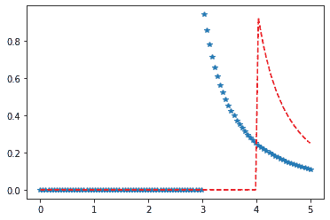

# Python–统计中的 kappa3 分布

> 原文:[https://www . geesforgeks . org/python-kappa 3-统计中的分布/](https://www.geeksforgeeks.org/python-kappa3-distribution-in-statistics/)

**scipy.stats.kappa3()** 是一个 kappa3 连续随机变量，用标准格式和一些形状参数定义，以完成其规格。概率密度以标准形式定义，loc 和 scale 参数用于移动和/或缩放分布。

**参数:**

> **q :** 上下尾概率
> T3】x:分位数
> **loc :** 【可选】位置参数。默认= 0
> **比例:**【可选】比例参数。默认值= 1
> **大小:**【整数元组，可选】形状或随机变量。
> **时刻:**【可选】由字母['mvsk']组成；m’=均值，‘v’=方差，‘s’= Fisher 偏斜度，‘k’= Fisher 峰度。(默认值= 'mv ')。
> 
> **结果:** kappa3 连续随机变量

**代码#1:创建 kappa3 连续随机变量**

```py
# importing library

from scipy.stats import kappa3  

numargs = kappa3.numargs 
a, b = 4.32, 3.18
rv = kappa3(a, b) 

print ("RV : \n", rv)  
```

**输出:**

```py
RV : 
 scipy.stats._distn_infrastructure.rv_frozen object at 0x000002A9D51A5F48

```

 **代码#2:强森 SU 连续变量和概率分布**

```py
import numpy as np 
quantile = np.arange (0.01, 1, 0.1) 

# Random Variates 
R = kappa3.rvs(a, b, scale = 2, size = 10) 
print ("Random Variates : \n", R) 
```

**输出:**

```py
Random Variates : 
 [5.52352397 4.77488722 5.6151088  5.46494471 3.7711133  4.89730708
 3.21392979 8.8291956  3.47994212 3.28716187]

```

**代码#3:图形表示。**

```py
import numpy as np 
import matplotlib.pyplot as plt 

distribution = np.linspace(0, np.minimum(rv.dist.b, 3)) 
print("Distribution : \n", distribution) 

plot = plt.plot(distribution, rv.pdf(distribution)) 
```

**输出:**

```py
Distribution : 
 [0\.         0.06122449 0.12244898 0.18367347 0.24489796 0.30612245
 0.36734694 0.42857143 0.48979592 0.55102041 0.6122449  0.67346939
 0.73469388 0.79591837 0.85714286 0.91836735 0.97959184 1.04081633
 1.10204082 1.16326531 1.2244898  1.28571429 1.34693878 1.40816327
 1.46938776 1.53061224 1.59183673 1.65306122 1.71428571 1.7755102
 1.83673469 1.89795918 1.95918367 2.02040816 2.08163265 2.14285714
 2.20408163 2.26530612 2.32653061 2.3877551  2.44897959 2.51020408
 2.57142857 2.63265306 2.69387755 2.75510204 2.81632653 2.87755102
 2.93877551 3\.        ]

```


**代码#4:变化的位置参数**

```py
import matplotlib.pyplot as plt 
import numpy as np 

x = np.linspace(0, 5, 100) 

# Varying positional arguments 
y1 = kappa3.pdf(x, 1, 3) 
y2 = kappa3.pdf(x, 1, 4) 
plt.plot(x, y1, "*", x, y2, "r--") 
```

**输出:**
