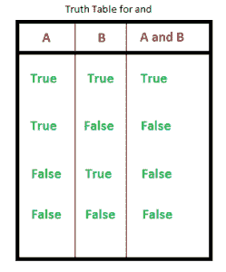
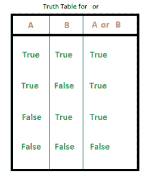

# Python 关键词

> 原文:[https://www.geeksforgeeks.org/python-keywords/](https://www.geeksforgeeks.org/python-keywords/)

**蟒蛇关键词:** [简介](https://www.geeksforgeeks.org/check-string-valid-keyword-python/)

**Python 中的关键字**是保留字，不能用作变量名、函数名或任何其他标识符。

## Python 中所有关键字的列表

<figure class="table">

| 和 | 如同 | [断言](https://www.geeksforgeeks.org/python-assert-keyword/) | [断开](https://www.geeksforgeeks.org/python-break-statement/) |
| [级](https://www.geeksforgeeks.org/python-classes-and-objects/) | [继续](https://www.geeksforgeeks.org/python-continue-statement/) | 极好的 | 的 |
| 艾列弗 | 其他 | [除了](https://www.geeksforgeeks.org/python-try-except/) | 错误的 |
| [最后](https://www.geeksforgeeks.org/finally-keyword-in-python/) | [为](https://www.geeksforgeeks.org/python-for-loops/) | 从 | [全局](https://www.geeksforgeeks.org/global-keyword-in-python/) |
| 如果 | [导入](https://www.geeksforgeeks.org/import-module-python/) | 在 | 是 |
| [λ](https://www.geeksforgeeks.org/python-lambda/) | 没有人 | 非局部的 | 不 |
| 或者 | [通过](https://www.geeksforgeeks.org/python-pass-statement/) | 上升 | [返回](https://www.geeksforgeeks.org/python-return-statement/) |
| 真实的 | [试试](https://www.geeksforgeeks.org/python-try-except/) | [而](https://www.geeksforgeeks.org/python-while-loop/) | [同](https://www.geeksforgeeks.org/with-statement-in-python/) |
| [产量](https://www.geeksforgeeks.org/python-yield-keyword/) |   |   |   |

</figure>

我们还可以使用下面的代码获得所有的关键字名称。

### 示例:Python 关键字列表

## 蟒蛇 3

```py
# Python code to demonstrate working of iskeyword()

# importing "keyword" for keyword operations
import keyword

# printing all keywords at once using "kwlist()"
print("The list of keywords is : ")
print(keyword.kwlist)
```

**输出:**

> 关键词列表为:
> 
> ['False '，' None '，' True '，' and '，' as '，' assert '，' async '，' await '，' break '，' class '，' continue '，' def '，' del '，' elif '，' else '，' except '，' finally '，' for '，' from '，' global '，' if '，' import '，' in '，' is '，' lambda '，' non '，

让我们借助好的例子详细讨论每个关键词。

## 真、假、无

*   **True:** 这个关键字用来表示布尔 True。如果陈述为真，则打印“真”。
*   **False:** 这个关键字用来表示一个布尔 False。如果声明为假，则打印“假”。
*   **无:**这是一个特殊的常数，用来表示空值或空值。重要的是要记住，0，任何空容器(例如空列表)都不会计算为无。
    它是其数据类型的对象——非类型。不可能创建多个无对象，并且可以将它们分配给变量。

### 示例:真、假和无关键字

## 蟒蛇 3

```py
print(False == 0)
print(True == 1)

print(True + True + True)
print(True + False + False)

print(None == 0)
print(None == [])
```

**Output**

```py
True
True
3
1
False
False

```

## 或者，不，在，是

*   **和**:这是 python 中的逻辑运算符。”**返回第一个假值。如果没有找到返回最后**。“和”的真值表如下所示。



3 和 0 **返回 0**

3 和 10 **返回 10**

10 或 20 或 30 或 10 或 70 返回 **10**

对于来自像 **C** 这样的语言的程序员来说，上面的语句可能有点令人困惑，在这种语言中，逻辑运算符总是返回布尔值(0 或 1)。以下几行直接来自解释这一点的 [python 文档](https://docs.python.org/3/reference/expressions.html#boolean-operations):

> 表达式 x 和 y 首先计算 x；如果 x 为 false，则返回其值；否则，计算 y 并返回结果值。
> 
> 表达式 x 或 y 首先计算 x；如果 x 为真，则返回其值；否则，计算 y 并返回结果值。

**注意**无论是 and 还是 or 都不会限制它们返回的值和类型为 False 和 True，而是返回最后一个求值的参数。这有时很有用，例如，如果 s 是一个字符串，如果它为空，则应该用默认值替换，则表达式 s 或“foo”会产生所需的值。因为 not 必须创建一个新值，所以它返回一个布尔值，而不管它的参数的类型是什么(例如，not 'foo '产生 False 而不是"。)

*   **或**:这是 python 中的逻辑运算符。或“返回第一个真值。如果没有找到，返回最后一个。“或”的真值表如下所示。



3 或 0 **返回 3**

3 或 10 **返回 3**

0 或 0 或 3 或 10 或 0 返回 **3**

*   **不是:**这个逻辑运算符反转真值。“不”的真值表如下。
*   **in:** 此关键字用于检查容器是否包含值。这个关键字也用于在容器中循环。
*   **为:**此关键字用于测试对象身份，即检查两个对象是否取相同的内存位置。

### 示例:关键字中的 and、or、not 为 and

## 计算机编程语言

```py
# showing logical operation
# or (returns True)
print(True or False)

# showing logical operation
# and (returns False)
print(False and True)

# showing logical operation
# not (returns False)
print(not True)

# using "in" to check
if 's' in 'geeksforgeeks':
    print("s is part of geeksforgeeks")
else:
    print("s is not part of geeksforgeeks")

# using "in" to loop through
for i in 'geeksforgeeks':
    print(i, end=" ")

print("\r")

# using is to check object identity
# string is immutable( cannot be changed once allocated)
# hence occupy same memory location
print(' ' is ' ')

# using is to check object identity
# dictionary is mutable( can be changed once allocated)
# hence occupy different memory location
print({} is {})
```

**输出:**

```py
True
False
False
s is part of geeksforgeeks
g e e k s f o r g e e k s 
True
False
```

## 迭代关键字–持续、中断、继续

*   [**为**](https://www.geeksforgeeks.org/python-for-loops/) **:** 此关键字用于控制流量和循环。
*   [**而**](https://www.geeksforgeeks.org/python-while-loop/) **:** 有一个类似于“for”的工作方式，用于控制流程和 for 循环。
*   [**断**](https://www.geeksforgeeks.org/python-break-statement/) **:** “断”是用来控制环路的流量。语句用于脱离循环，并将控制权传递给紧接在循环之后的语句。
*   [**continue**](https://www.geeksforgeeks.org/python-continue-statement/)**:**“continue”也是用来控制代码的流向。关键字跳过循环的当前迭代，但不结束循环。

### 示例:For，while，break，continue 关键字

## 蟒蛇 3

```py
# Using for loop
for i in range(10):

    print(i, end = " ")

    # break the loop as soon it sees 6
    if i == 6:
        break

print()

# loop from 1 to 10
i = 0
while i <10:

    # If i is equals to 6,
    # continue to next iteration
    # without printing
    if i == 6:
        i+= 1
        continue
    else:
        # otherwise print the value
        # of i
        print(i, end = " ")

    i += 1
```

**Output**

```py
0 1 2 3 4 5 6 
0 1 2 3 4 5 7 8 9 
```

## 条件关键字–if，else，elif

*   **if** :是决策的控制语句。**真理表达迫使控制进入“如果”语句块。**
*   **else** :是决策的控制语句。**虚假表达迫使控制进入“否则”语句块。**
*   **elif** :是决策的控制语句。它是“**否则如果**的简称

### 示例:if、else 和 elif 关键字

## 蟒蛇 3

```py
# Python program to illustrate if-elif-else ladder
#!/usr/bin/python

i = 20
if (i == 10):
    print ("i is 10")
elif (i == 20):
    print ("i is 20")
else:
    print ("i is not present")
```

**Output**

```py
i is 20

```

**注意:**更多信息，请参考 [Python if else 教程](https://www.geeksforgeeks.org/python-if-else/)。

## 极好的

def 关键字用于声明用户定义的函数。

### 示例:def 关键字

## 蟒蛇 3

```py
# def keyword
def fun():
    print("Inside Function")

fun()
```

**Output**

```py
Inside Function

```

## **返回关键词–返回，收益**

*   [**返回:**](https://www.geeksforgeeks.org/python-return-statement/) 这个关键字是用来从函数返回的。
*   [**yield :**](https://www.geeksforgeeks.org/python-yield-keyword/) 这个关键字和 return 语句一样使用，但是用来返回一个生成器。

### 示例:返回和收益关键字

## 蟒蛇 3

```py
# Return keyword
def fun():
    S = 0

    for i in range(10):
        S += i
    return S

print(fun())

# Yield Keyword
def fun():
    S = 0

    for i in range(10):
        S += i
        yield S

for i in fun():
    print(i)
```

**Output**

```py
45
0
1
3
6
10
15
21
28
36
45

```

## 班级

[**类**](https://www.geeksforgeeks.org/python-classes-and-objects/) 关键字用于声明用户定义的类。

### 示例:类关键字

## 蟒蛇 3

```py
# Python3 program to
# demonstrate instantiating
# a class

class Dog:

    # A simple class
    # attribute
    attr1 = "mammal"
    attr2 = "dog"

    # A sample method
    def fun(self):
        print("I'm a", self.attr1)
        print("I'm a", self.attr2)

# Driver code
# Object instantiation
Rodger = Dog()

# Accessing class attributes
# and method through objects
print(Rodger.attr1)
Rodger.fun()
```

**Output**

```py
mammal
I'm a mammal
I'm a dog

```

**注意:**更多信息请参考我们的 [Python 类和对象教程](https://www.geeksforgeeks.org/python-classes-and-objects/)。

## 随着

[](https://www.geeksforgeeks.org/with-statement-in-python/)**关键字用于将代码块的执行包装在上下文管理器定义的方法中。这个关键词在日常编程中使用不多。**

### **示例:带关键字**

## **蟒蛇 3**

```py
# using with statement
with open('file_path', 'w') as file:
    file.write('hello world !')
```

## **如同**

****as** 关键字用于为导入的模块创建别名。即给导入的模块起一个新的名字。将数学作为我的数学导入。**

### **示例:作为关键字**

## **蟒蛇 3**

```py
import math as gfg

print(gfg.factorial(5))
```

****Output**

```py
120

```** 

## **及格**

**[**pass**](https://www.geeksforgeeks.org/python-pass-statement/) 是 python 中的 null 语句。遇到这种情况时，什么也不会发生。这用于防止缩进错误，并用作占位符。**

### **示例:传递关键字**

## **蟒蛇 3**

```py
n = 10
for i in range(n):

# pass can be used as placeholder
# when code is to added later
pass
```

## **希腊字母的第 11 个**

**[**【Lambda】**](https://www.geeksforgeeks.org/python-lambda/)关键字用于进行内部不允许语句的内联返回函数。**

### **示例:Lambda 关键字**

## **蟒蛇 3**

```py
# Lambda keyword
g = lambda x: x*x*x

print(g(7))
```

****Output**

```py
343

```** 

## **导入，自**

*   **[**导入**](https://www.geeksforgeeks.org/import-module-python/) **:** 此语句用于将特定模块包含到当前程序中。**
*   ****from :** 一般用于导入，from 用于从导入的模块导入特定功能。**

### **示例:导入，来自关键字**

## **蟒蛇 3**

```py
# import keyword
import math
print(math.factorial(10))

# from keyword
from math import factorial
print(factorial(10))
```

****Output**

```py
3628800
3628800

```** 

## **异常处理关键字–尝试，除，引发，最后，断言**

*   **[**try :**](https://www.geeksforgeeks.org/python-try-except/) 这个关键字用于异常处理，用于捕捉代码中使用关键字除外的错误。“尝试”块中的代码被检查，如果有任何类型的错误，除了块被执行。**
*   **[**除了:**](https://www.geeksforgeeks.org/python-try-except/) 如上所述，这与“尝试”一起工作来捕捉异常。**
*   **[**最终:**](https://www.geeksforgeeks.org/finally-keyword-in-python/) 无论“尝试”块的结果是什么，被称为“最终”的块总是被执行。**
*   ****引发:**我们可以使用 raise 关键字显式引发异常**
*   **[**断言:**](https://www.geeksforgeeks.org/python-assert-keyword/) 该功能用于**调试目的**。通常用于检查代码的正确性。如果一条语句被评估为真，则不会发生任何事情，但是当它为假时，会引发“ **AssertionError** ”。也可以**打印错误信息，用逗号**隔开。**

### **示例:尝试，除，引发，最后，断言关键字**

## **蟒蛇 3**

```py
# initializing number
a = 4
b = 0

# No exception Exception raised in try block
try:
    k = a//b # raises divide by zero exception.
    print(k)

# handles zerodivision exception
except ZeroDivisionError:
    print("Can't divide by zero")

finally:
    # this block is always executed
    # regardless of exception generation.
    print('This is always executed')

# assert Keyword  
# using assert to check for 0
print ("The value of a / b is : ")
assert b != 0, "Divide by 0 error"
print (a / b)
```

****输出****

```py
Can't divide by zero
This is always executed
The value of a / b is :
AssertionError: Divide by 0 error
```

****注意:**更多信息请参考我们的教程[Python 异常处理教程。](https://www.geeksforgeeks.org/python-exception-handling/)**

## **的**

****[**del**](https://www.geeksforgeeks.org/python-del-to-delete-objects/) 用于删除对对象的引用。使用 del 可以删除任何变量或列表值。****

### ****示例:删除关键字****

## ****蟒蛇 3****

```py
**my_variable1 = 20
my_variable2 = "GeeksForGeeks"

# check if my_variable1 and my_variable2 exists
print(my_variable1)
print(my_variable2)

# delete both the variables
del my_variable1
del my_variable2

# check if my_variable1 and my_variable2 exists
print(my_variable1)
print(my_variable2)**
```

******输出******

```py
**20
GeeksForGeeks
NameError: name 'my_variable1' is not defined**
```

## ****全球，非本地****

*   ****[**全局:**](https://www.geeksforgeeks.org/global-keyword-in-python/) 这个关键字用来定义函数内部的一个变量是全局范围的。****
*   ******非局部:**这个关键字的工作方式类似于全局，但不是全局，这个关键字声明一个变量指向外部封闭函数的变量，如果是嵌套函数。****

### ****示例:全局和非本地关键字****

## ****蟒蛇 3****

```py
**# global variable
a = 15
b = 10

# function to perform addition
def add():
    c = a + b
    print(c)

# calling a function
add()

# nonlocal keyword
def fun():
    var1 = 10

    def gun():
        # tell python explicitly that it
        # has to access var1 initialized
        # in fun on line 2
        # using the keyword nonlocal
        nonlocal var1

        var1 = var1 + 10
        print(var1)

    gun()
fun()**
```

******Output**

```py
25
20

```**** 

******注意:**更多信息请参考我们 Python 中的[全局和局部变量教程。](https://www.geeksforgeeks.org/global-local-variables-python/)****

****本文由 [**曼吉特·辛格(S. Nandini)**](https://www.facebook.com/manjeet.04.singh) 供稿。如果你喜欢 GeeksforGeeks 并想投稿，你也可以使用[write.geeksforgeeks.org](https://write.geeksforgeeks.org)写一篇文章或者把你的文章邮寄到 review-team@geeksforgeeks.org。看到你的文章出现在极客博客主页上，帮助其他极客。
如果发现有不正确的地方，或者想分享更多关于上述话题的信息，请写评论。****