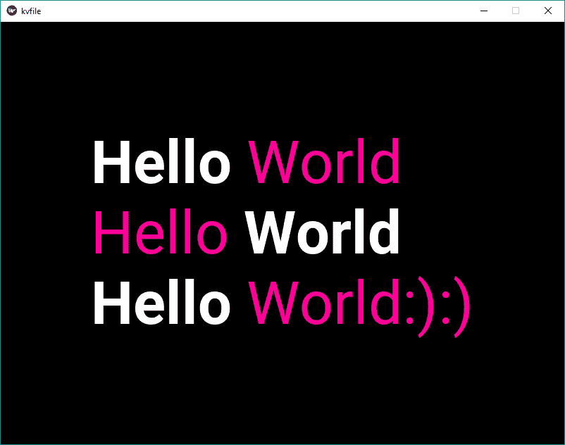

# Python | Kivy。千伏文件

> 哎哎哎:# t0]https://www . geeksforgeeks . org/python-kivy-kv 文件/

就像我们用 Python [kivy](https://www.geeksforgeeks.org/kivy-tutorial/) 编写应用程序一样，在同一个代码上写所有的东西会把代码搞得一团糟，很难被另一个人理解。此外，编写一个大的代码很难维护小部件树的结构和明确的绑定声明。
KV 语言允许我们以声明的方式创建自己的小部件树，并以自然的方式将小部件属性相互绑定或与回调绑定。

> ？？？？？？？？ [Kivy 教程–通过示例学习 Kivy](https://www.geeksforgeeks.org/kivy-tutorial/)。

**如何加载** ***kv*** **文件:**
有 2 种加载方式。千伏文件编码或应用

*   **按名称约定方法-**
    在编写代码时我们将制作 App 类。对于此方法，文件和应用程序类的名称是相同的，并使用 appclassname.kv 保存 kv 文件。
    Kivy 查找与您的应用程序类同名的小写 kv 文件，如果以“app”结尾，则减去“App”，例如:

```
classnameApp ---> classname.kv
```

如果此文件定义了根小部件，它将被附加到应用程序的根属性，并用作应用程序小部件树的基础。
示例代码如何使用。kivy 中的 kv 文件如下所示:

## 蟒蛇 3

```
# code how to use .kv file in kivy

# import kivy module
import kivy

# base Class of your App inherits from the App class.
# app:always refers to the instance of your application
from kivy.app import App

# this restrict the kivy version i.e
# below this kivy version you cannot
# use the app or software
# not compulsory to write it
kivy.require('1.9.1')

# define the App class
# and just pass rest write on kvfile
# not necessary to pass
# can also define function in it
class kvfileApp(App):
    pass

kv = kvfileApp()
kv.run()
```

*   **。kv 文件代码保存与应用程序类同名–**

## 蟒蛇 3

```
Label:
    text:
        ('[b]Hello[/b] [color = ff0099]World[/color]\n'
        '[color = ff0099]Hello[/color] [b]World[/b]\n'
        '[b]Hello[/b] [color = ff0099]World:):)[/color]')
    markup: True
    font_size: '64pt'
```

**输出:**



*   **Builder 方法-**
    要使用此方法，首先必须通过编写导入 Builder

```
from kivy.lang import builder
```

现在，通过构建器，您可以直接将整个文件作为字符串或文件加载。这样做是为了装载。kv 文件作为文件:

```
Builder.load_file('.kv/file/path')
```

或者，对于加载，kv 文件为字符串:

```
Builder.load_string(kv_string)
```

## 蟒蛇 3

```
# code to use the .kv file as a string in the main file
# code how to use .kv file in kivy

# import kivy module
import kivy

# base Class of your App inherits from the App class.
# app:always refers to the instance of your application
from kivy.app import App

# it is to import Builder
from kivy.lang import Builder

# this restrict the kivy version i.e
# below this kivy version you cannot use the app or software
# not compulsory to write it
kivy.require('1.9.1')

# building kv file as string
kvfile = Builder.load_string("""
Label:
    text:
        ('[b]Hello[/b] [color = ff0099]World[/color]\\n'
        '[color = ff0099]Hello[/color] [b]World[/b]\\n'
        '[b]Hello[/b] [color = ff0099]World:):)[/color]')
    markup: True
    font_size: '64pt'
""")

# define the App class
# and just pass rest write on kvfile
# not necessary to pass
# can also define function in it
class kvfileApp(App):
    def build(self):
        return kvfile

kv = kvfileApp()
kv.run()
```

**输出:**

