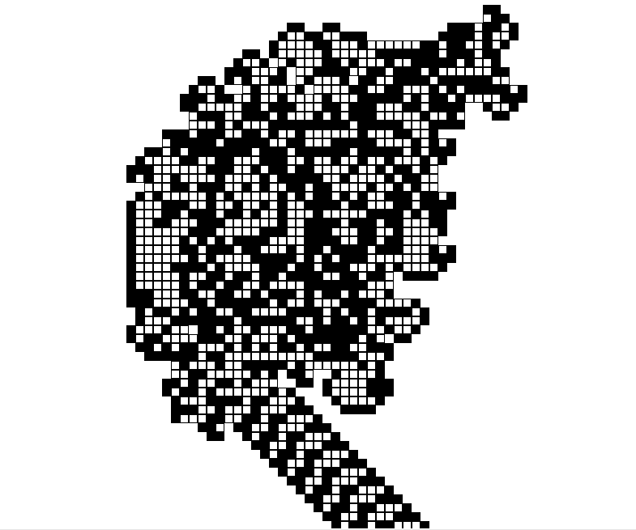

# python | langton’s ant

> 哎哎哎:# t0]https://www . geeksforgeeks . org/python-langons-ant/

**朗顿的蚂蚁**是一台 4 态二维通用图灵机。它是由克里斯·朗顿在 1986 年发明的。它基本上是一只蚂蚁，坐在最初是白色的正方形格子细胞上。蚂蚁在平面上移动，改变细胞的颜色，在上面形成图案。但是蚂蚁的运动不是随机的；它遵循以下规则:

*   如果蚂蚁在一个黑色的正方形上，它会向右旋转 90 度并向前移动一个单位。
*   如果蚂蚁在一个白色的正方形上，它向左转 90 度，向前移动一个单位。
*   当蚂蚁离开一个正方形时，它会反转颜色。

当蚂蚁开始时，它会在移动时创建一个黑白图案。最初，这些变化并不独特，但是当我们一遍又一遍地重复它时，一个美丽的模式出现了。但是如果我们进一步增加迭代的次数(比如说~ 10000 次)，蚂蚁开始以逐渐的转移重复它的路径，而不是制造新的模式。因此，我们获得了类似于无限模式的*高速公路。蚂蚁在高速公路上不停地移动，并给出了以下模式。
T3】*

在此参考[对朗顿蚂蚁的视觉解说。这有助于直观地了解蚂蚁是如何工作的。](https://www.youtube.com/watch?v=NWBToaXK5T0)

朗顿蚂蚁的 Python-3 代码如下:

```py
# importing turtle module
import turtle

def langton():

    # Initializing the Window
    window = turtle.Screen()
    window.bgcolor('white')
    window.screensize(1000,1000)

    # Contains the coordinate and colour
    maps = {}

    # Initializing the Ant
    ant = turtle.Turtle()

    # shape of the ant
    ant.shape('square')    

    # size of the ant
    ant.shapesize(0.5)

    # speed of the ant
    ant.speed(10000)                                 

    # gives the coordinate of the ant                
    pos = coordinate(ant)                             

    while True:

        # distance the ant will move
        step = 10                                     
        if pos not in maps or maps[pos] == "white":

            #inverts the colour
            ant.fillcolor("black")        

            #stamps a copy of the ant on the canvas
            ant.stamp()                                 
            invert(maps, ant, "black")
            ant.right(90)

            #moves the ant forward
            ant.forward(step)                         
            pos = coordinate(ant)

        elif maps[pos] == "black":
            ant.fillcolor("white")
            invert(maps, ant, "white")

            ant.stamp()
            ant.left(90)
            ant.forward(step)
            pos = coordinate(ant)

def invert(graph, ant, color):
    graph[coordinate(ant)] = color

def coordinate(ant):
    return (round(ant.xcor()), round(ant.ycor()))

langton()
```

**输出:**

此处，白色单元格用' '(空格)表示，黑色单元格用' '(点)表示。