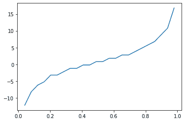
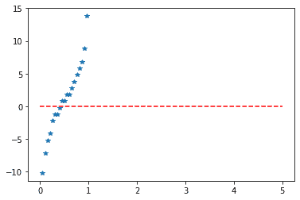

# 统计中的 Python 拉普拉斯分布

> 原文:[https://www . geesforgeks . org/python-laplacian-distribution-in-statistics/](https://www.geeksforgeeks.org/python-laplacian-distribution-in-statistics/)

**scipy.stats.dlaplace()** 是拉普拉斯离散随机变量。它继承自泛型方法的，作为 **rv_discrete 类**的实例。它用特定于这个特定分布的细节来完成这些方法。

**参数:**

> **x :** 分位数
> **loc :** 【可选】位置参数。默认= 0
> **刻度:**【可选】刻度参数。默认= 1
> **时刻:**【可选】由字母['mvsk']组成；m’=均值，‘v’=方差，‘s’= Fisher 偏斜度，‘k’= Fisher 峰度。(默认值= 'mv ')。
> 
> **结果:**拉普拉斯离散随机变量

**代码#1:创建拉普拉斯离散随机变量**

```py
# importing library

from scipy.stats import dlaplace 

numargs = dlaplace .numargs 
a, b = 0.2, 0.8
rv = dlaplace (a, b) 

print ("RV : \n", rv)  
```

**输出:**

```py
RV : 
 scipy.stats._distn_infrastructure.rv_frozen object at 0x0000016A4C4B4908

```

**代码#2:拉普拉斯离散变量和概率分布**

```py
import numpy as np 
quantile = np.arange (0.01, 1, 0.1) 

# Random Variates 
R = dlaplace .rvs(a, b, size = 10) 
print ("Random Variates : \n", R) 

# PDF 
x = np.linspace(dlaplace.ppf(0.01, a, b),
                dlaplace.ppf(0.99, a, b), 10)
R = dlaplace.ppf(x, 1, 3)
print ("\nProbability Distribution : \n", R) 
```

**输出:**

```py
Random Variates : 
 [ 2  0  1  3 14  0  1 14  6  0]

Probability Distribution : 
 [nan nan nan nan nan nan nan nan nan nan]

```

**代码#3:图形表示。**

```py
import numpy as np 
import matplotlib.pyplot as plt 

distribution = np.linspace(0, np.minimum(rv.dist.b, 2)) 
print("Distribution : \n", distribution) 

plot = plt.plot(distribution, rv.ppf(distribution)) 
```

**输出:**

```py
Distribution : 
 [0\.         0.04081633 0.08163265 0.12244898 0.16326531 0.20408163
 0.24489796 0.28571429 0.32653061 0.36734694 0.40816327 0.44897959
 0.48979592 0.53061224 0.57142857 0.6122449  0.65306122 0.69387755
 0.73469388 0.7755102  0.81632653 0.85714286 0.89795918 0.93877551
 0.97959184 1.02040816 1.06122449 1.10204082 1.14285714 1.18367347
 1.2244898  1.26530612 1.30612245 1.34693878 1.3877551  1.42857143
 1.46938776 1.51020408 1.55102041 1.59183673 1.63265306 1.67346939
 1.71428571 1.75510204 1.79591837 1.83673469 1.87755102 1.91836735
 1.95918367 2\.        ]

```



**代码#4:变化的位置参数**

```py
import matplotlib.pyplot as plt 
import numpy as np 

x = np.linspace(0, 5, 100) 

# Varying positional arguments 
y1 = dlaplace.ppf(x, a, b) 
y2 = dlaplace.pmf(x, a, b) 
plt.plot(x, y1, "*", x, y2, "r--") 
```

**输出:**

