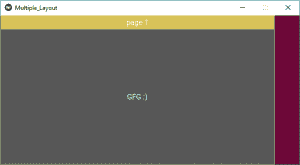
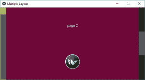
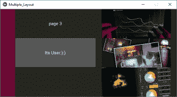

# Python | Kivy 中布局(多个布局)中的布局

> 原文:[https://www . geesforgeks . org/python-layouts-in-layouts-multi-layouts-in-kivy/](https://www.geeksforgeeks.org/python-layouts-in-layouts-multiple-layouts-in-kivy/)

Kivy 是 Python 中独立于平台的 GUI 工具。因为它可以在安卓、IOS、linux 和 Windows 等平台上运行。它基本上是用来开发安卓应用程序的，但并不意味着它不能在桌面应用程序上使用。
在本文中，我们将讨论如何在布局中使用布局基本上是多个布局最基本的例子。
大多数时候我们能够使用一个布局，但是很难使用多个布局。

> [Kivy 教程–通过示例学习 Kivy](https://www.geeksforgeeks.org/kivy-tutorial/)。

在 kivy 中有许多类型的布局:

1.  [**锚定布局:**](https://www.geeksforgeeks.org/python-anchorlayout-in-kivy-using-kv-file/) 小部件可以锚定在“顶部”、“底部”、“左侧”、“右侧”或“中心”。
2.  [**盒子布局:**](https://www.geeksforgeeks.org/python-create-box-layout-widget-using-kv-file/) 小部件按“垂直”或“水平”方向顺序排列。
3.  [**浮动布局:**](https://www.geeksforgeeks.org/python-floatlayout-in-kivy-using-kv-file/) 小部件本质上是不受限制的。
4.  **相对布局:**子部件相对于布局定位。
5.  [**网格布局:**](https://www.geeksforgeeks.org/gridlayouts-in-kivy-python/) 小部件排列在由行和列属性定义的网格中。
6.  [**页面布局**](https://www.geeksforgeeks.org/python-pagelayout-in-kivy/) **:** 用于创建简单的多页面布局，允许使用边框轻松地从一个页面切换到另一个页面。
7.  [**【分散布局:**](https://kivy.org/doc/stable/api-kivy.uix.scatterlayout.html) 小部件的位置类似于相对布局，但它们可以平移、旋转和缩放。
8.  [**StackLayout:**](https://www.geeksforgeeks.org/python-stacklayout-in-kivy-using-kv-file/) 小部件按照 lr-tb(从左到右，然后从上到下)或 tb-lr 顺序堆叠。

**注意:**可以在一个文件中使用任意多个。

在一个文件中创建多个布局的基本方法:

```
1) import kivy
2) import kivyApp
3) import BoxLayout
4) import 
4) set minimum version(optional)
5) Extend the container class
6) set up .kv file :
7) create App class
8) return container class or layout
9) Run an instance of the class
```

**实施方法–**
**主文件**

**注意:**
如果你用的是。kv 文件制作多个布局不需要导入 Gridlayout、Boxlayout、AnchorLayout、FloatLayout、StackLayout、PageLayout、Button 等。作为。kv 文件支持所有这些，因为它已经导入了所有这些。但是如果没有。你必须导入这些文件。

## 蟒蛇 3

```
## Sample Python application demonstrating the
## Program of How to use Multiple Layouts in Single file

########################################################################

# import kivy module  
import kivy

# base Class of your App inherits from the App class.  
# app:always refers to the instance of your application 
from kivy.app import App

# this restrict the kivy version i.e
# below this kivy version you cannot
# use the app or software
kivy.require('1.9.0')

# creates the button in kivy 
# if not imported shows the error
from kivy.uix.button import Button

# BoxLayout arranges children in a vertical or horizontal box.
# or help to put the childrens at the desired location.
from kivy.uix.boxlayout import BoxLayout

# The GridLayout arranges children in a matrix.
# It takes the available space and
# divides it into columns and rows,
# then adds widgets to the resulting “cells”.
from kivy.uix.gridlayout import GridLayout

# The PageLayout class is used to create
# a simple multi-page layout,
# in a way that allows easy flipping from
# one page to another using borders.
from kivy.uix.pagelayout import PageLayout

########################################################################

# creating the root widget used in .kv file
class MultipleLayout(PageLayout):
    pass

########################################################################

# creating the App class in which name
#.kv file is to be named PageLayout.kv
class Multiple_LayoutApp(App):
    # defining build()
    def build(self):
        # returning the instance of root class
        return MultipleLayout()

########################################################################

# creating object of Multiple_LayoutApp() class
MlApp = Multiple_LayoutApp()

# run the class
MlApp.run()
```

在这个文件中，我们创建/使用所有的布局，因为它更容易构建/使用所有这些。千伏档
[**。千伏文件**T4**的代码**](https://www.geeksforgeeks.org/python-kivy-kv-file/)

## 蟒蛇 3

```
# Program of How to use Multiple Layouts in Single .kv file

########################################################################

# creating page Layout
<PageLayout>:

#########################################################################

    # Creating Page 1

    # Using BoxLayout inside PageLayout
    BoxLayout:

        # creating Canvas
        canvas:
            Color:
                rgba: 216 / 255., 195 / 255., 88 / 255., 1
            Rectangle:
                pos: self.pos
                size: self.size

        # Providing orientation to the BoxLayout
        orientation: 'vertical'

        # Adding Label to Page 1
        Label:
            size_hint_y: None
            height: 1.5 * self.texture_size[1]
            text: 'page 1'

        # Creating Button
        Button:
            text: 'GFG :)'

            # Adding On_press function
            # i.e binding function to press / touch
            on_press: print("This Is The First Page")

#########################################################################

    # Creating Page 2

    BoxLayout:
        orientation: 'vertical'
        canvas:
            Color:
                rgba: 109 / 255., 8 / 255., 57 / 255., 1
            Rectangle:
                pos: self.pos
                size: self.size
        Label:
            text: 'page 2'

        # This Image is directly from the websource
        # By using AsyncImage you can use that
        AsyncImage:
            source: 'http://kivy.org / logos / kivy-logo-black-64.png'

##########################################################################

    # Creating Page 3

    # Using The Second Layout
    # Creating GridLayout
    GridLayout:

        canvas:
            Color:
                rgba: 37 / 255., 39 / 255., 30 / 255., 1
            Rectangle:
                pos: self.pos
                size: self.size

        # Adding grids to Page 3
        # It may be row or column
        cols: 2

        # In first Grid
        # Adding Label + Image
        Label:
            text: 'page 3'

        AsyncImage:
            source: 'http://kivy.org/slides/kivyandroid-thumb.jpg'

        # In Second Grid
        # Adding Button + Image
        Button:
            text: 'Its User:):)'
            on_press: print("Heloo User This is the Last Page")

        AsyncImage:
            source: 'http://kivy.org/slides/kivypictures-thumb.jpg'

        # In third grid
        # Adding Widget + Image

        Widget

        AsyncImage:
            source: 'http://kivy.org/slides/particlepanda-thumb.jpg'
```

**输出:**
**图像 1:**



**图像 2:**



**图像 3:**



**视频输出:**

<video class="wp-video-shortcode" id="video-307347-1" width="640" height="360" preload="metadata" controls=""><source type="video/webm" src="https://media.geeksforgeeks.org/wp-content/uploads/20190524002414/Multiple-layout.webm?_=1">[https://media.geeksforgeeks.org/wp-content/uploads/20190524002414/Multiple-layout.webm](https://media.geeksforgeeks.org/wp-content/uploads/20190524002414/Multiple-layout.webm)</video>

**参考:**T2https://kivy.org/doc/stable/gettingstarted/layouts.html