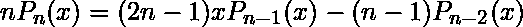
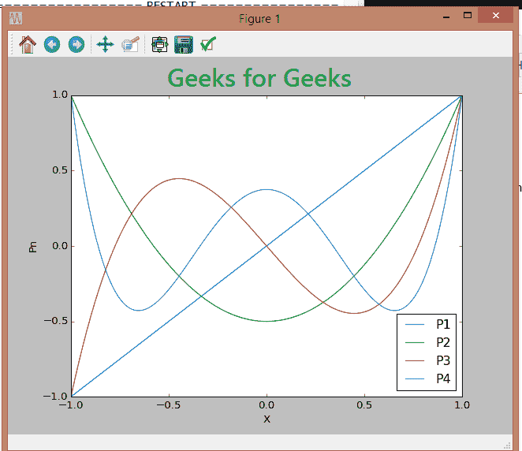

# Python–使用递归关系的勒让德多项式

> 原文:[https://www . geesforgeks . org/python-Legendre-多项式-使用-递归-关系/](https://www.geeksforgeeks.org/python-legendre-polynomials-using-recursion-relation/)

勒让德多项式是科学和工程中经常出现的一类正交多项式。因此，他们这一代对这些领域至关重要。计算勒让德多项式有不同的方法，使用生成函数、罗德里格斯公式、递推关系、格拉姆-施密特正交化等。最简单也是
最准确的方法之一，就是使用递推关系。

这里我们使用勒让德多项式的邦纳递推关系，即–



它可以通过如下步骤使用 Python 实现-

我们将勒让德多项式定义为一个名为 P(n，x)的函数，其中 n 称为多项式的阶，x 是求值点。基本情况是，如果 n 是 0，那么多项式的值总是 1，当阶是 1 时，它是 x。这些是循环关系所需的种子值。
对于 n 的其他值，直接从 Bonnet 的递归中递归定义函数。因此，P(n，x)通过递归方法返回勒让德多项式的值(用同一函数本身的其他基本情况有效定义的函数。)

下面是 Python 实现–

```
# Legendre polynomial
def P(n, x): 
    if(n == 0):
        return 1 # P0 = 1
    elif(n == 1):
        return x # P1 = x
    else:
        return (((2 * n)-1)*x * P(n-1, x)-(n-1)*P(n-2, x))/float(n)

# Suppose, we want to find the value of 
# 3rd order legendre polynomial at x = 5
# We can display the value by--

# Driver program
n = 3
X = 5
print("The value of the polynomial at given point is:", P(n, X))
```

**Output:**

```
The value of the polynomial at given point is: 305.0

```

我们现在还可以使用 matplotlib 绘制勒让德多项式(比如从一阶到四阶)。

```
import matplotlib

# This is for use in webbrowser, can be ignored.
matplotlib.use('Agg') 

import matplotlib.pyplot as plt
import numpy as np

# Creating an array of x values
x = np.linspace(-1, 1, 200) 

# for which polynomial values are evaluated and plotted
for i in range(1, 5):

    # Labelling according to order
    plt.plot(x, P(i, x), label ="P"+str(i)) 

plt.legend(loc ="best")
plt.xlabel("X")
plt.ylabel("Pn")
plt.show()
```

