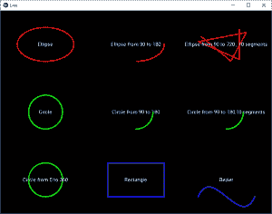

# Python | kivy 中的线条(画布)

> 原文:[https://www.geeksforgeeks.org/python-line-canvas-in-kivy/](https://www.geeksforgeeks.org/python-line-canvas-in-kivy/)

Kivy 是 Python 中独立于平台的 GUI 工具。因为它可以在安卓、IOS、linux 和视窗等平台上运行。它基本上是用来开发安卓应用程序的，但并不意味着它不能在桌面应用程序上使用。

> [Kivy 教程–通过示例学习 Kivy](https://www.geeksforgeeks.org/kivy-tutorial/)。

## 线条画布:

线条是顶点画布指令。它允许通过点画线。这段代码展示了如何使用/绘制扩展的线条画，如圆、椭圆、矩形和贝塞尔曲线等。

```
Basic Approach:

1) import kivy
2) import kivy App
3) import Gridlayout
4) import widget
5) set minimum version(optional)
6) Create as much as widget class as needed
7) create the App class
8) return the widget/layout etc class
9) Run an instance of the class
```

**实施方式:**
**#主. py**

## 蟒蛇 3

```
# kivy Lines Demo

# import kivy module 
import kivy 

# base Class of your App inherits from the App class.   
# app:always refers to the instance of your application   
from kivy.app import App 

# The GridLayout arranges children in a matrix.
# It takes the available space and
# divides it into columns and rows,
# then adds widgets to the resulting “cells”.
from kivy.uix.gridlayout import GridLayout

# Widgets are elements of
# a graphical user interface that
# form part of the User Experience.
from kivy.uix.widget import Widget

##############################################
# Classes form Different types of line as  widgets

class LineEllipse1(Widget):
    pass

class LineEllipse2(Widget):
    pass

class LineEllipse3(Widget):
    pass

class LineCircle1(Widget):
    pass

class LineCircle2(Widget):
    pass

class LineCircle3(Widget):
    pass

class LineCircle4(Widget):
    pass

class LineRectangle(Widget):
    pass

class LineBezier(Widget):
    pass

# Create the App class
class LineApp(App):
    def build(self):

        # Assign the number of column, spacing and padding
        root = GridLayout(cols = 3, padding = 50, spacing = 100)

        # Adding the widgets
        root.add_widget(LineEllipse1())
        root.add_widget(LineEllipse2())
        root.add_widget(LineEllipse3())
        root.add_widget(LineCircle1())
        root.add_widget(LineCircle2())
        root.add_widget(LineCircle3())
        root.add_widget(LineCircle4())
        root.add_widget(LineRectangle())
        root.add_widget(LineBezier())
        return root

# Run the App class
if __name__ == '__main__':
    LineApp().run()
```

**线千伏文件:**

## 蟒蛇 3

```
# Line.kv file of the code

# Creating Different types of Lines(or shapes through line)

###########################################

# Row 1:

# Ellipse(1st row 1st element)

<LineEllipse1>:

    # Creating Canvas
    canvas:
        Color:
            rgba: 1, .1, .1, .9
        # Ellipse Creation
        Line:
            width: 2.
            ellipse: (self.x, self.y, self.width, self.height)

    # Label the figure
    Label:
        center: root.center
        text: 'Ellipse'

############################################

# Ellipse from 90 to 180((1st row 2nd element))

<LineEllipse2>:
    canvas:
        Color:
            rgba: 1, .1, .1, .9
        Line:
            width: 2.
            ellipse: (self.x, self.y, self.width, self.height, 90, 180)
    Label:
        center: root.center
        text: 'Ellipse from 90 to 180'

############################################

# Ellipse from 90 to 720, 10 segments(1st row 3rd element)

<LineEllipse3>:
    canvas:
        Color:
            rgba: 1, .1, .1, .9
        Line:
            width: 2.
            ellipse: (self.x, self.y, self.width, self.height, 90, 720, 10)
    Label:
        center: root.center
        text: 'Ellipse from 90 to 720, 10 segments'
        halign: 'center'

############################################

# Circle(2nd row 1st element)
<LineCircle1>:
    canvas:
        Color:
            rgba: .1, 1, .1, .9
        Line:
            width: 2.
            circle:
                (self.center_x, self.center_y, min(self.width, self.height)
                / 2)
    Label:
        center: root.center
        text: 'Circle'

############################################

# Circle from 90 to 180(2nd row 2nd element)
<LineCircle2>:
    canvas:
        Color:
            rgba: .1, 1, .1, .9
        Line:
            width: 2.
            circle:
                (self.center_x, self.center_y, min(self.width, self.height)
                / 2, 90, 180)
    Label:
        center: root.center
        text: 'Circle from 90 to 180'

############################################
# Circle from 90 to 180, 10 segments(1st row 3rd element)
<LineCircle3>:
    canvas:
        Color:
            rgba: .1, 1, .1, .9
        Line:
            width: 2.
            circle:
                (self.center_x, self.center_y, min(self.width, self.height)
                / 2, 90, 180, 10)
    Label:
        center: root.center
        text: 'Circle from 90 to 180, 10 segments'
        halign: 'center'

############################################

# Circle from 0 to 360 (3rd row 1st element)
<LineCircle4>:
    canvas:
        Color:
            rgba: .1, 1, .1, .9
        Line:
            width: 2.
            circle:
                (self.center_x, self.center_y, min(self.width, self.height)
                / 2, 0, 360)
    Label:
        center: root.center
        text: 'Circle from 0 to 360'
        halign: 'center'

############################################

# Rectangle (3rd row 2nd element)
<LineRectangle>:
    canvas:
        Color:
            rgba: .1, .1, 1, .9
        Line:
            width: 2.
            rectangle: (self.x, self.y, self.width, self.height)
    Label:
        center: root.center
        text: 'Rectangle'

############################################

# Bezier (3rd row 3rd element)
<LineBezier>:
    canvas:
        Color:
            rgba: .1, .1, 1, .9
        Line:
            width: 2.
            bezier:
                (self.x, self.y, self.center_x - 40, self.y + 100,
                self.center_x + 40, self.y - 100, self.right, self.y)
    Label:
        center: root.center
        text: 'Bezier'
```

**输出:**

