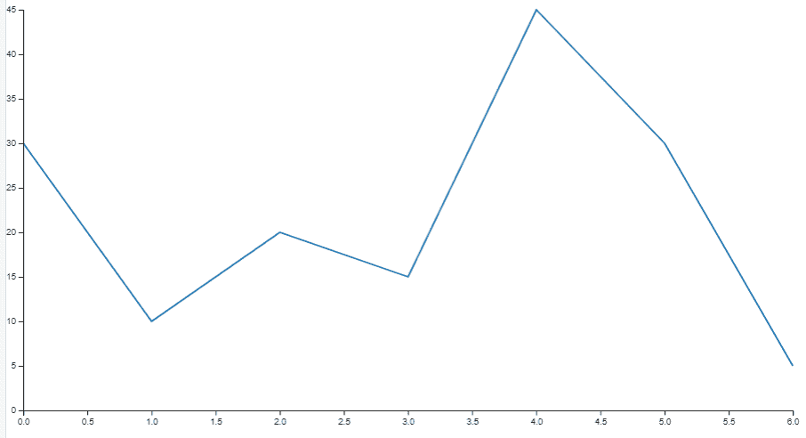
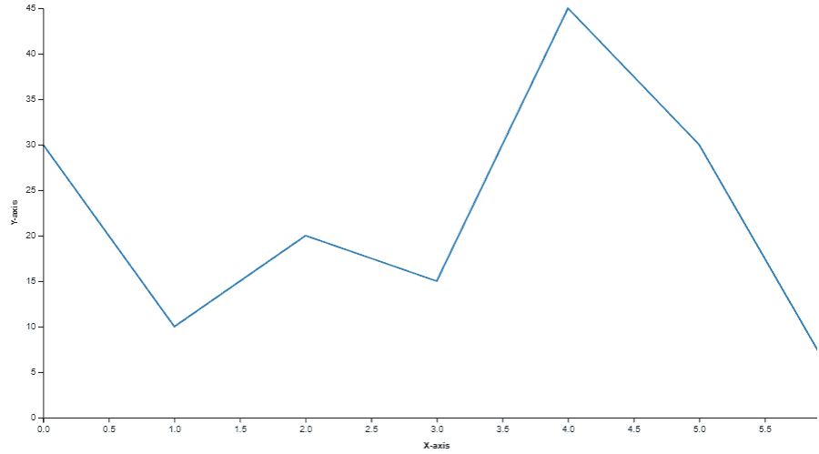

# Python |文森特中的折线图

> 原文:[https://www . geesforgeks . org/python-折线图-in-vincent/](https://www.geeksforgeeks.org/python-line-charts-in-vincent/)

在本文中，我们将在文森特的帮助下创建折线图。python 中哪个库做 python 到 vega 的翻译？它具有 python 的数据能力和 javascript 的可视化能力。它是专门为快速绘制数据帧和系列而构建的。

**要求:安装文森特**

```
$pip install vincent
```

**警告:**需要熊猫，熊猫需要数字

**例 1:** 简单折线图

```
# import the vincent library=
import vincent

# To initialize vincent in the notebook
vincent.core.initialize_notebook()

# pass the parameters to the bar method
Line = vincent.Line([10, 20, 30, 20, 15, 30, 45])

# Display the line chart
Line.display()
```

**输出:**


**示例 2:** 带轴标签的折线图

```
# import the vincent library
import vincent

# To initialize vincent in the notebook
vincent.core.initialize_notebook()

# pass the parameters to the bar method
Line = vincent.Line([10, 20, 30, 20, 15, 30, 45])

# give axis names
Line.axis_titles(x='X-axis', y='Y-axis')

# Display the line chart
Line.display()
```

**输出:**


有关文森特折线图和文森特的更多信息，请访问此[链接](https://vincent.readthedocs.io/en/latest/quickstart.html#quick-data)