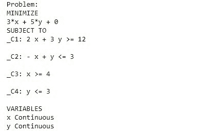

# Python |纸浆中的线性规划

> 原文:[https://www . geeksforgeeks . org/python-线性编程-在纸浆中/](https://www.geeksforgeeks.org/python-linear-programming-in-pulp/)

[线性规划(LP)](https://en.wikipedia.org/wiki/Linear_programming) ，也称为**线性优化**是一种数学规划技术，用于在需求由线性关系表示的数学模型中获得最佳结果或结果，如最大利润或最小成本。线性规划是数学规划的特例，也称为数学优化。
一般来说，一个组织或公司主要有两个目标，第一个是最小化，第二个是最大化。最小化意味着生产总成本最小化，而最大化意味着利润最大化。因此，借助线性规划图解法，我们可以找到最优解。

**线性规划的基本术语**

*   **目标函数:**问题的主要目标，要么最大化要么最小化，是线性规划的目标函数。在下面显示的问题中，Z(最小化)是目标函数。
*   **决策变量:**用于决定输出的变量为决策变量。它们是数学编程模型的未知数。在下面的问题中，我们要确定 x 和 y 的值，以便最小化 z。这里，x 和 y 是决策变量。
*   **约束:**这些是对决策变量的限制。在下面问题的约束下给出的决策变量的限制是线性规划的约束。
*   **非负约束:**在线性规划中，决策变量的值总是大于或等于 0。

**注:**对于一个线性规划问题，目标函数、约束和非负约束必须是线性的。

**例 1:** 考虑以下问题:

```py
Minimize :  Z = 3x + 5y
Subject to the constraints: 
2x + 3y >= 12
-x + y <= 3
x >= 4
y <= 3
x, y >= 0

```

**在 Python 中求解上述线性规划问题:**
pull 是 Python 生态系统中众多求解优化问题的库之一。您可以在 Jupyter 笔记本中安装 PlAY，如下所示:

```py
import sys !{sys.executable} -m pip install pulp
```

**代码:用 Python 解决前面提到的线性规划问题:**

```py
# import the library pulp as p
import pulp as p

# Create a LP Minimization problem
Lp_prob = p.LpProblem('Problem', p.LpMinimize) 

# Create problem Variables 
x = p.LpVariable("x", lowBound = 0)   # Create a variable x >= 0
y = p.LpVariable("y", lowBound = 0)   # Create a variable y >= 0

# Objective Function
Lp_prob += 3 * x + 5 * y   

# Constraints:
Lp_prob += 2 * x + 3 * y >= 12
Lp_prob += -x + y <= 3
Lp_prob += x >= 4
Lp_prob += y <= 3

# Display the problem
print(Lp_prob)

status = Lp_prob.solve()   # Solver
print(p.LpStatus[status])   # The solution status

# Printing the final solution
print(p.value(x), p.value(y), p.value(Lp_prob.objective))  
```

### **说明:**

现在，让我们一步一步地理解代码:

*   **1-2 线:**首先将库浆作为 p 导入。
*   **第 4-5 行:**通过给你的问题取一个合适的名字来定义问题，这里我给的名字是‘问题’。此外，指定目标函数的目标是最大化还是最小化。
*   **第 7-9 行:**定义 LpVariable 来保存目标函数的变量。下一个参数指定定义变量的下限，即 0，默认情况下上限为无。您也可以指定上限。
*   **第 11-12 行:**用定义的变量表示目标函数。
*   **14-18 行:**这些是对变量的约束。
*   **第 21 行:**这将在输出屏幕中向您显示问题。
*   **第 23 行:**这是问题求解器。
*   **第 24 行:**将显示问题的状态。
*   **第 27 行:**将打印 x 和 y 的值以及目标函数的最小值。

**查看输出**

```py
# Display the problem
print(Lp_prob)
```

**输出**


```py
status = Lp_prob.solve()   # Solver
print(p.LpStatus[status])   # The solution status
```

**输出**

```py
Optimal
```

```py
# Printing the final solution
print(p.value(x), p.value(y), p.value(Lp_prob.objective))
```

**输出**

```py
6.0 0.0 18.0
```

x 和 y 的最佳值分别为 **6.0 和 0.0** 。优化后的目标函数值为 **18.0。**