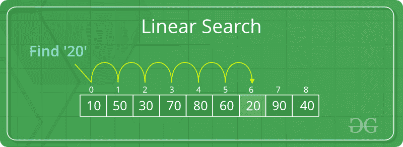

# Python |对列表或元组进行线性搜索

> 原文:[https://www . geesforgeks . org/python-linear-在列表或元组中搜索/](https://www.geeksforgeeks.org/python-linear-search-on-list-or-tuples/)

让我们看看 Python 列表和元组的基本线性搜索操作。

一个简单的方法是进行**线性搜索**，即

*   从列表最左边的元素开始，逐个比较 x 和列表的每个元素。
*   如果 x 与某个元素匹配，则返回 True。
*   如果 x 与任何元素都不匹配，则返回 False。



**示例#1:** 列表上的线性搜索

```py
# Search function with parameter list name
# and the value to be searched
def search(list,n):

    for i in range(len(list)):
        if list[i] == n:
            return True
    return False

# list which contains both string and numbers.
list = [1, 2, 'sachin', 4,'Geeks', 6]

# Driver Code
n = 'Geeks'

if search(list, n):
    print("Found")
else:
    print("Not Found")
```

**Output:**

```py
Found

```

请注意，列表是可变的，但元组不是。

**示例#2:** 元组中的线性搜索

```py
# Search function with parameter list name
# and the value to be searched
def search(Tuple, n):

    for i in range(len(Tuple)):
        if Tuple[i] == n:
            return True
    return False

# list which contains both string and numbers.
Tuple= (1, 2, 'sachin', 4, 'Geeks', 6)

# Driver Code
n = 'Geeks'

if search(Tuple, n):
    print("Found")
else:
    print("Not Found")
```

**Output:**

```py
Found

```